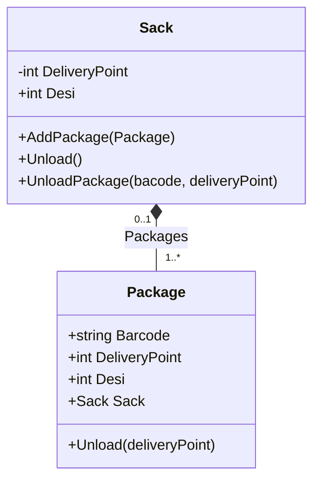

```mermaid
classDiagram
    Sack  "0..1" *-- "1..*" Package: Packages

    class Sack{
        -int DeliveryPoint
        +int Desi

        +AddPackage(Package)
        +Unload()
        +UnloadPackage(bacode, deliveryPoint)
    }

    class Package{
        +string Barcode
        +int DeliveryPoint
        +int Desi
        +Sack Sack
        +Unload(deliveryPoint)
    }

```
