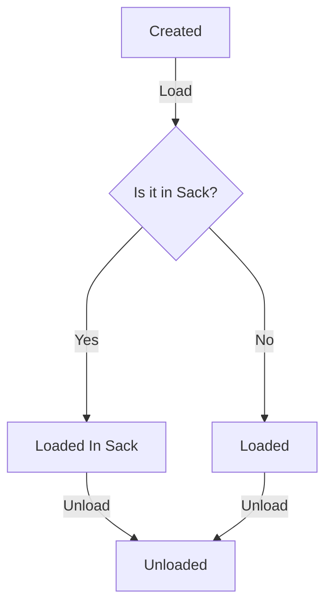
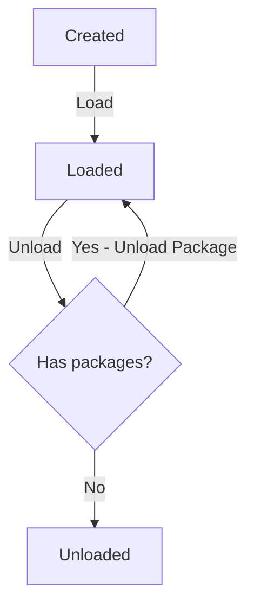

### Package State

```mermaid
flowchart TD
    A[Created] -->|Load| B{Is it in Sack?}
    B -->|Yes| C[Loaded In Sack]
    B ---->|No| E[Loaded]
    C -->|Unload| F[Unloaded]
    E -->|Unload| F[Unloaded]
```

### Sack State

```mermaid
flowchart TD
    B[Created] -->|Load| C[Loaded]
    C-->|Unload| D{Has packages?}
    D -->|Yes - Unload Package| C
    D -->|No| E[Unloaded]
```
