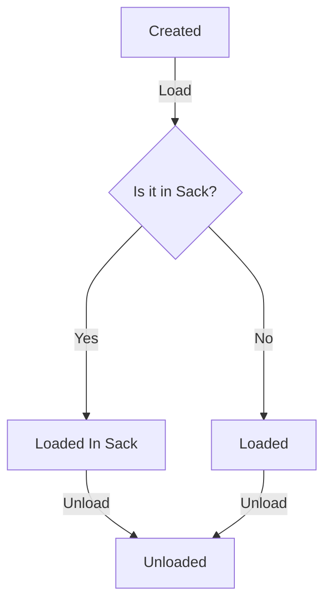
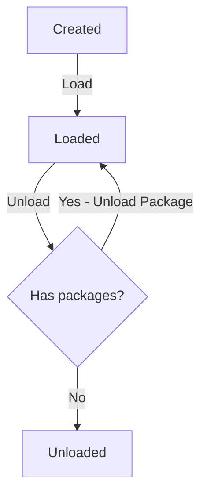

<h1 align="left"> Trendyol Fleet Management </h1>

<h3 align="left">Backend Application </h3>

### Description

In this application, we want you to design a small fleet management system where vehicles carry shipments and deliver them to predetermined locations along a specific route.

The system has two different types of shipments that can be transported in vehicles and unloaded at delivery points. Delivery points where the shipments will go, the barcodes of the shipments and the desi (size of the shipments) are stored on the shipment.

```
Shipment Types:
* Package: Refers to a single good.
* Sack: Refers to shipment type that consists more than one good.
```

```
There are three different delivery points in the system.
* Branch: Only packages can be unloaded. Sacks and packages in sacks can not be unloaded.
* Distribution Center: Sacks, packages in sacks and packages that are not assigned to a sack can be unloaded.
* Transfer Center: Only sacks and packages in sacks can be unloaded.
```

Delivery points may not unload shipments that do not comply with the above conditions. In such a case, that shipment should be skipped and the other shipments requested to be unloaded should be tried.

Shipments take “created” state when they are first created, switch to “loaded” state when they are loaded into a sack, and switch to “unloaded” when they are unloaded at the delivery point.

Only packages with the same delivery point as the sack can be loaded into the sacks.

When a shipment is loaded in a sack, the loaded shipment becomes “loaded in sack,” while the sack remains in the “created” state.

As the packages in the sack are unloaded one by one, the sack also goes into the "unloaded" state when all of the packages have been successfully unloaded.

If the sack itself is unloaded from the vehicle before the shipments inside the sack are unloaded, the sack and all the shipments inside the sack will switch to "unloaded".

Vehicles should go to the delivery points assigned to them and ensure that the relevant shipments are unloaded at the relevant delivery points.

### Table of States

You can think of it as an enum or a table.

| Package State Names | Value |
| ------------------- | ----- |
| Created             | 1     |
| Loaded into Sack    | 2     |
| Loaded              | 3     |
| Unloaded            | 4     |

| Sack State Names | Value |
| ---------------- | ----- |
| Created          | 1     |
| Loaded           | 3     |
| Unloaded         | 4     |

To set up the system above:
We expect you to store the following parameters in a predefined way in a database of your choice. You can assign the data to the database of your choice in any way you want. You can improve your database (can also be in memory) and domain modelling in accordance with the following items.

### Package State



### Sack State



**1.** You can create the delivery points in the databases you choose with the following data.

### Delivery Points Table

| Delivery Point Name | Value |
| ------------------- | ----- |
| Branch              | 1     |
| Distribution Centre | 2     |
| Transfer Centre     | 3     |

**2.** You can create the sacks in the databases you choose with the following data.

### Sack Table

| Barcode | Delivery Point Type to be unloaded at |
| ------- | ------------------------------------- |
| C725799 | 2                                     |
| C725800 | 3                                     |

**3.** You can create the packages in the databases you choose with the following data.

### Package Table

| Barcode     | Delivery Point to be unloaded at | Desi |
| ----------- | -------------------------------- | ---- |
| P7988000121 | 1                                | 5    |
| P7988000122 | 1                                | 5    |
| P7988000123 | 1                                | 9    |
| P8988000120 | 2                                | 33   |
| P8988000121 | 2                                | 17   |
| P8988000122 | 2                                | 26   |
| P8988000123 | 2                                | 35   |
| P8988000124 | 2                                | 1    |
| P8988000125 | 2                                | 200  |
| P8988000126 | 2                                | 50   |
| P9988000126 | 3                                | 15   |
| P9988000127 | 3                                | 16   |
| P9988000128 | 3                                | 55   |
| P9988000129 | 3                                | 28   |
| P9988000130 | 3                                | 17   |

**4.** You can create the packages to be loaded in sacks in the databases you choose with the following data.

### Sack Package Table

| Barcode     | Barcode of the sack |
| ----------- | ------------------- |
| P8988000122 | C725799             |
| P8988000126 | C725799             |
| P9988000128 | C725800             |
| P9988000129 | C725800             |

We expect you to develop a rest endpoint that receives the following json content for the vehicle to distribute the packages to the delivery points. In the first step, you must switch all the packages and sacks listed and loaded into the appropriate sack to the "loaded" state. You should then unload all available shipments at the delivery points in the list provided and update their status to "unloaded". Note: Vehicle property is provided for information purposes only.

```
{
  "vehicle": "34 TL 34",
  "route": [
    {
      "deliveryPoint": 1,
      "deliveries": [
        {"barcode": "P7988000121"},
        {"barcode": "P7988000122"},
        {"barcode": "P7988000123"},
        {"barcode": "P8988000121"},
        {"barcode": "C725799"}
      ]
    },
    {
      "deliveryPoint": 2,
      "deliveries": [
        {"barcode": "P8988000123"},
        {"barcode": "P8988000124"},
        {"barcode": "P8988000125"},
        {"barcode": "C725799"}
      ]
    },
    {
      "deliveryPoint": 3,
      "deliveries": [
        {"barcode": "P9988000126"},
        {"barcode": "P9988000127"},
        {"barcode": "P9988000128"},
        {"barcode": "P9988000129"},
        {"barcode": "P9988000130"}
      ]
    }
  ]
}
```

**Test Results**

- When downloading packages to delivery points, we expect you to log the Delivery Point - Barcode pairs sent incorrectly in the json above. We expect you to log it in a table you will create yourself.
- We expect you to show the status of unloaded and not unloaded records on the database.
- We expect the shipment with barcode P8988000120 to remain in "created" state.
- We are waiting for a log for barcodes P8988000121 and C725799 (due to attempted delivery to the wrong location).
- We expect barcode P8988000121 to remain in the "loaded" state.
- We expect sack C725800 to be in the "unloaded" state.
- We expect barcode P8988000122 to be in the "unloaded" state.
- We expect barcode P8988000126 to be in the "unloaded" state.

**Expected Result:**

```
{
  "vehicle": "34 TL 34",
  "route": [
    {
      "deliveryPoint": 1,
      "deliveries": [
        {"barcode": "P7988000121", "state":4},
        {"barcode": "P7988000122", "state":4},
        {"barcode": "P7988000123", "state":4},
        {"barcode": "P8988000121", "state":3},
        {"barcode": "C725799", "state":3}
      ]
    },
    {
      "deliveryPoint": 2,
      "deliveries": [
        {"barcode": "P8988000123", "state":4},
        {"barcode": "P8988000124", "state":4},
        {"barcode": "P8988000125", "state":4},
        {"barcode": "C725799", "state":4}
      ]
    },
    {
      "deliveryPoint": "3",
      "deliveries": [
        {"barcode": "P9988000126", "state":3},
        {"barcode": "P9988000127", "state":3},
        {"barcode": "P9988000128", "state":4},
        {"barcode": "P9988000129", "state":4},
        {"barcode": "P9988000130", "state":3}
      ]
    }
  ]
}
```

**You should be aware of the following conventions while you are working on this application:**

- Publish a running project
- Apply SOLID and OOP principles
- Document your project for a developer
- Handle exceptions for resilient web service
- Test Driven Development is a good choice, but it's up to you how you are testing your code.
- Nice to have: Dockerize your project

You should commit to a local git repository and include the git repository (.git/) in the upload.

Please include **"case is done"** in your last commit.

NOTE: Please **DO NOT** publish the project on Github, Gitlab, etc. We will provide a private github repository
for you and we expect you to push your changes to that private repository or send your workspace folder
as compressed.

## Follow Us!

[Trendyol Tech Medium](https://medium.com/trendyol-tech)

[Trendyol Open Source GitHub](https://github.com/Trendyol)

[Trendyol Tech Youtube](https://www.youtube.com/channel/UCUBiayLMggBAsiYvGLzQJ5w)

[Trendyol Tech Kommunity](https://kommunity.com/@trendyol)
